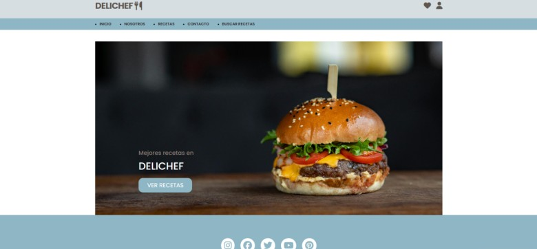
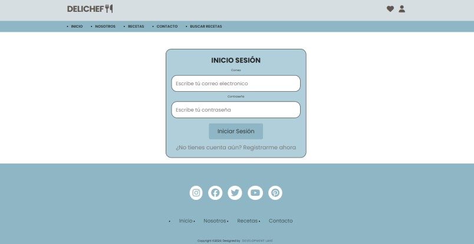
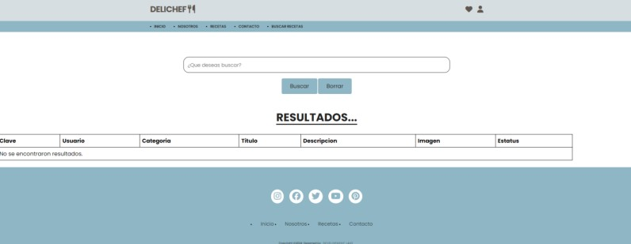
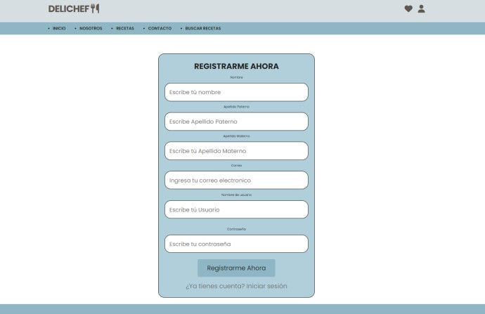
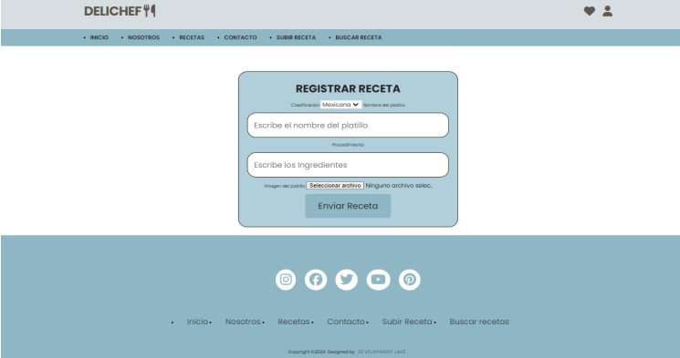
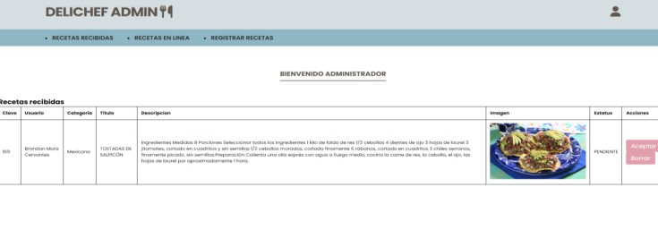
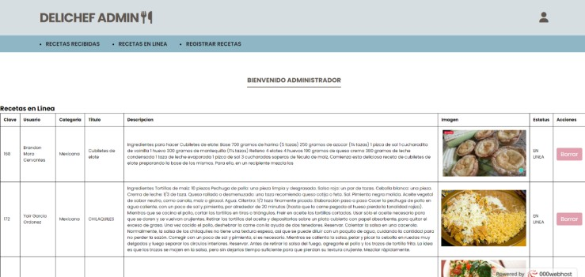

# 🧁 DeliChef

**DeliChef** es una plataforma dinámica dirigida a entusiastas de la cocina, que permite a los usuarios **compartir recetas únicas** y **descubrir nuevas creaciones culinarias**.

Su objetivo principal es crear un espacio donde los usuarios puedan **subir sus recetas de cocina** y también **consultar las de otros**, fomentando así el intercambio y la comunidad gastronómica.

---

## Tecnologías utilizadas

- 🐘 **PHP** — Lógica del lado servidor
- 🗄️ **MySQL** — Base de datos relacional
- 🎨 **HTML & CSS** — Interfaz de usuario
- 🔗 **SOAP** — Protocolo para servicios web

---

## Inicio de la pagina

  

## Login de la pagina

  

## Lista de recetas
Flujo alterno donde no hay recetas disponibles

  

## Insertar usuario
Formulario para los nuevos usuarios

  

## Insertar receta
Formulario para crear una receta, solo disponible para usuarios registrados

  

## Recetas recibidas
El adminstrador tenia que aceptar o denegar las recetas de usuarios

  

## Recetas en linea
Despues de que el administrador aceptaba una receta, se mostraba en el tablero de recetas con estatus de aprobado

  

### ⚠️ Nota importante

> A pesar de que se puede cargar con un servicio de apache en xampp o wampp (ademas de cargar la base de datos), el servicio no funcionara correctamente, ya que cuenta con una uri alojada en un Hosting al que ya no se tiene acceso
